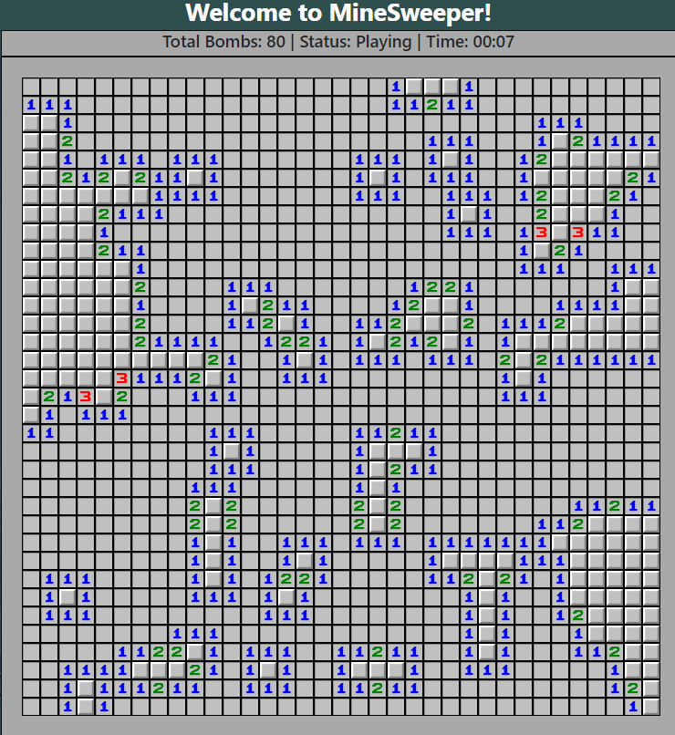

# MineSweeper

## Epicodus Pair Project Week 4 - Javascript/Angular - October 28th, 2018

### By **Brian Nelson** && **Ryan Lee**

## Description

Recreating the classic game Minesweeper utilizing Angular. During my coding bootcamp's javascript 4 week module, this project was done after 2 weeks of intensive Angular practice.

## Gameplay

## Known bugs & Missing Features

* No right click functionality was created to mark cells with bombs
* Timer does not stop after game is won

## Contact & Support

* Brian nelson - nelsonsbrian@gmail.com
* Ryan Lee - hyungnaelee@gmail.com

## Technologies used
* Angular
* JavaScript
* Node.js